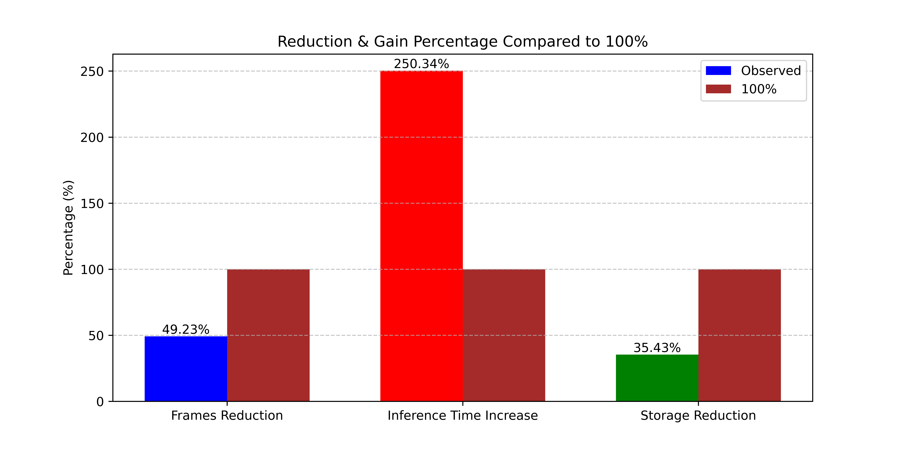
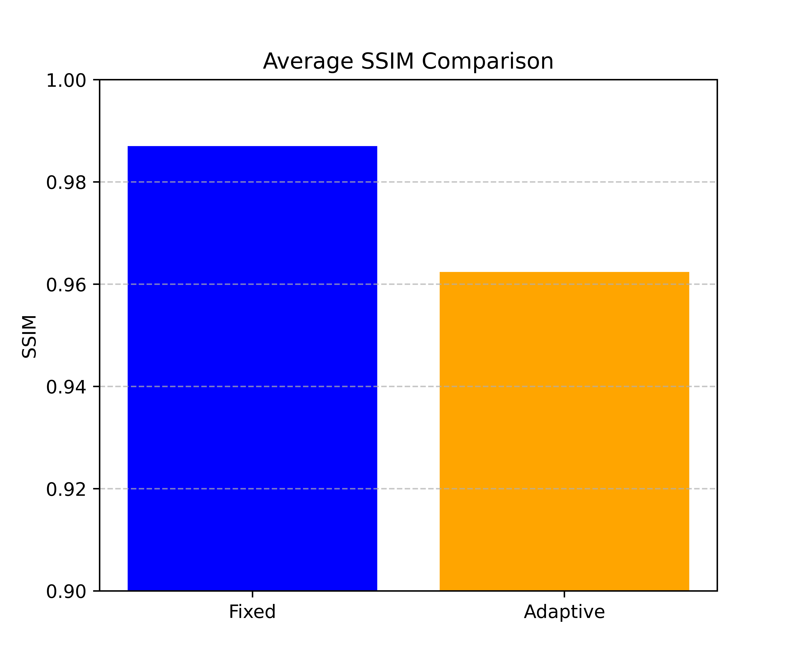

# FRAME-FLOW: A Real-Time Video Frame Interpolation

## Overview

FRAME-FLOW is a real-time video frame interpolation project designed to generate intermediate frames between two consecutive video frames. This technique is useful for applications such as improving video quality, smooth transitions in animations, and reducing motion blur. 

The project includes two methods for frame interpolation: a **Fixed Depth** method and an **Adaptive Depth** method. The adaptive method dynamically adjusts the number of intermediate frames generated based on the similarity between the original frames and the interpolated ones, optimizing the video generation process.

## Project Files

- **`frame-flow.ipynb`**: Jupyter Notebook implementing the frame interpolation models and functions.
- **`baseline.mp4`**: Video output generated using the Fixed Depth interpolation method.
- **`optimized.mp4`**: Video output generated using the Adaptive Depth interpolation method.
- **`psnr_comparison.png`**: Bar chart comparing the average PSNR (Peak Signal-to-Noise Ratio) of both methods.
- **`reduction_gain_comparison.png`**: Bar chart comparing the reduction and gain percentages (frame reduction, inference time increase, and storage reduction).
- **`ssim_comparison.png`**: Bar chart comparing the average SSIM (Structural Similarity Index) of both methods.
- **`model-frameflow.zip`**: Model weights and additional files required for frame interpolation.

## Methods Used

### Fixed Depth Interpolation
- **Inference Time**: 2.969 seconds
- **Frames Generated**: A fixed number of frames (depth=6) between the start and end frames.
- **SSIM**: 0.987
- **PSNR**: 41.99 dB

### Adaptive Depth Interpolation
- **Inference Time**: 10.4001 seconds
- **Frames Reduction**: 49.23%
- **Inference Time Increase**: 250.34%
- **Storage Reduction**: 35.43%
- **SSIM**: 0.9624
- **PSNR**: 36.72 dB

## Results

### Comparison of Fixed and Adaptive Methods

| Metrics (Avg)                | Fixed    | Adaptive |
| ---------------------------- | -------- | -------- |
| **Inference Time (sec)**      | 2.969    | 10.4001  |
| **Frame Reduction (%)**       | -        | 49.23    |
| **Inference Time Increase (%)** | -      | 250.34   |
| **Storage Reduction (%)**     | -        | 35.43    |
| **SSIM**                      | 0.987    | 0.9624   |
| **PSNR (dB)**                 | 41.99    | 36.72    |

### Graphs

#### **PSNR Comparison**  


#### **Reduction & Gain Comparison**  


#### **SSIM Comparison**  


## How It Works

1. **Model Setup**: The frame interpolation model (RIFE) is loaded and evaluated.
2. **Frame Interpolation**: The `generate_interpolated_frame()` function is used to generate intermediate frames between two consecutive frames.
3. **Adaptive vs Fixed Depth**: The Adaptive method dynamically adjusts the number of frames based on the similarity between the original frames and interpolated frames, while the Fixed Depth method generates a fixed number of frames.
4. **Metrics Calculation**: SSIM and PSNR are used to evaluate the quality of the generated frames.

## Requirements

- Python 3.x
- PyTorch
- OpenCV
- MoviePy
- NumPy
- Matplotlib
- Skimage
- psutil
- torchvision

## Installation

Ensure you have all dependencies installed using pip:

```bash
pip install torch opencv-python moviepy numpy matplotlib scikit-image psutil torchvision
